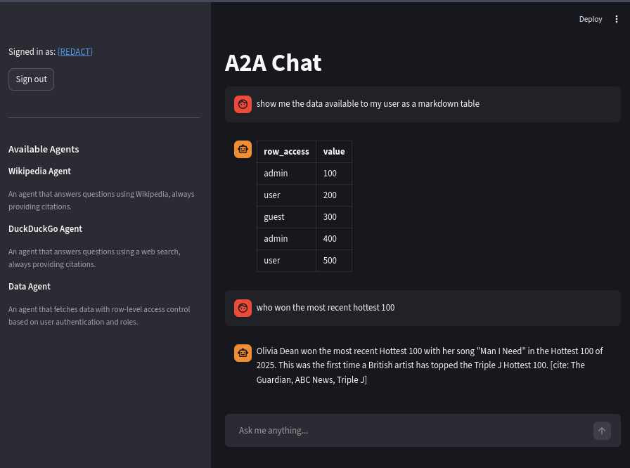
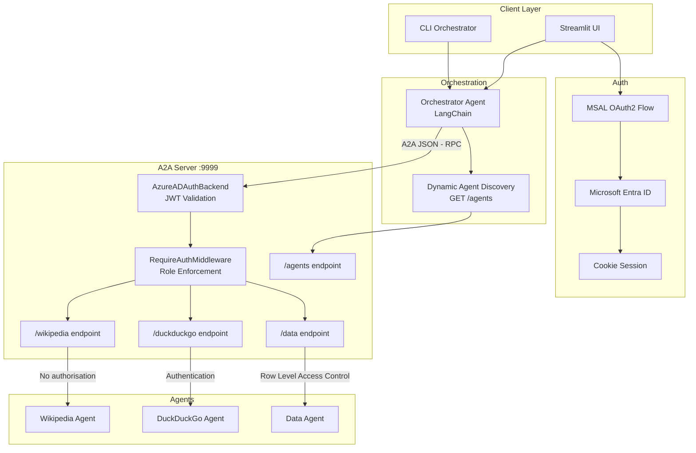
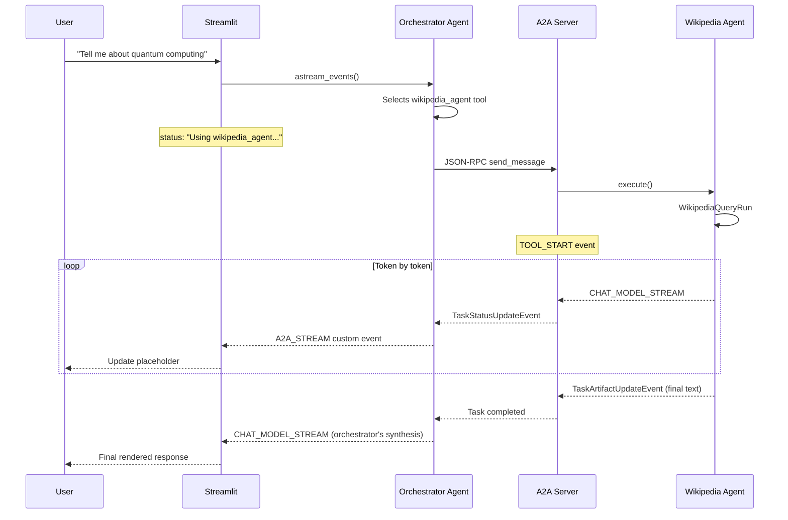
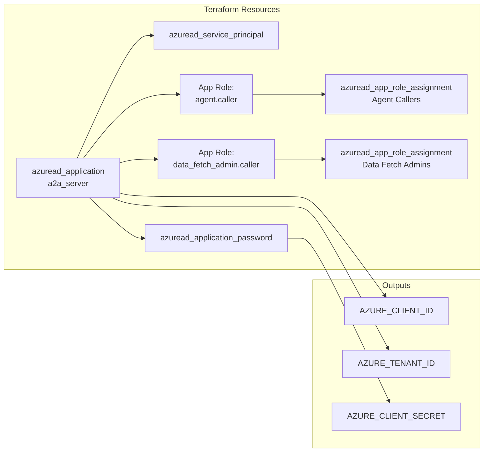
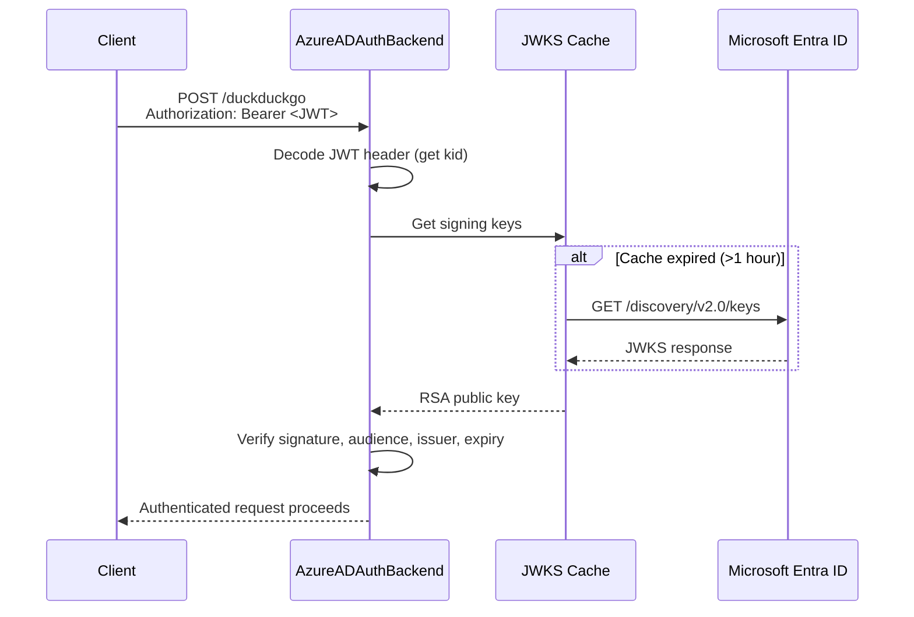

My test of trying to implement Agent to Agent (A2A) via LangChain with Entra authentication 



## Structure

```
a2a/
├── infra/
│   ├── main.tf              # App registration, roles, assignments
│   ├── variables.tf          # UPNs, redirect URIs
│   └── outputs.tf            # Client ID, secret, tenant ID
├── src/
│   ├── agents/
│   │   ├── wiki/             # Wikipedia agent + card
│   │   ├── duck/             # DuckDuckGo agent + card
│   │   └── text_agent/       # Data agent with row-level access
│   ├── client/
│   │   ├── common.py         # Shared A2A tool factory
│   │   ├── orchestrator_agent/  # CLI orchestrator
│   │   └── streamlit_app/    # Streamlit UI + auth
│   ├── mcp_server/
│   │   ├── base.py           # Starlette server + routing
│   │   ├── auth.py           # JWT validation + middleware
│   │   ├── text_executor.py  # LangChain ↔ A2A bridge
│   │   └── types.py          # Streaming event types
│   └── util/
│       ├── settings.py       # Pydantic settings from .env
│       └── config.py         # LLM configuration
└── pyproject.toml            # uv project with entry points
```

## About

I wanted to know a few things

* How does A2A work
* How does Authentication with A2A (Entra AD)
  * How do I pass Authentication claims to a tool
  * How do I restrict access to certain Agents via AD group
* How do I autodiscover agents
  * How do I ensure that I don't discover agents that I don't have access to.
* How do I stream responses
* How do I keep conversation history

Here's what I ended up building

| Agent            | Endpoint      | Access Level                                                                                          | Purpose                            |
|------------------|---------------|-------------------------------------------------------------------------------------------------------|------------------------------------|
| Wikipedia Agent  | `/wikipedia`  | Public                                                                                                | Search Wikipedia with citations    |
| DuckDuckGo Agent | `/duckduckgo` | `agent.caller` role required                                                                          | Web search with citations          |
| Data Agent       | `/data`       | Public - row level filtering based on authorization (user) and admin role (`data_fetch_admin.caller`) | Fetch data rows based on user role |



## Quick Start

### Setup Terraform

This is required if you want to test anything authentication related.

* Ensure that you have the azure-cli and terraform-cli installed.
* Set the `agent_caller_upns` and `data_fetch_admin_caller_upns` for the user principal names that you want to be added
  to the various roles.

Run `terraform apply` to set up the application registration, application roles and add the roles to the users.
To extract the protected `azure_client_secret` run `terraform output -raw azure_client_secret`

### Run Python Code

* Add the environment variables from the previous steps to your environment (a .env is available at root)
* `uv sync` to install the requirements, then run the A2A server and whichever clients you want to test out.

 | Feature | Command |
  |------------------|---------------------------|
  | CLI client | `uv run a2a-orchestrator` |
  | Streamlit client | `uv run a2a-client`       |
  | A2A Server | `uv run a2a-server`       |

## How it works

### Auto Agent Discovery

I expose an `/agents` endpoint that returns a list
of [agent cards](https://a2a-protocol.org/latest/tutorials/python/3-agent-skills-and-card/#agent-card)
based on what the user has access to, this prevents models trying to call agents that they have no access to (
DuckDuckGoAgent)

```python
from starlette.applications import Starlette
from starlette.requests import Request
from starlette.responses import JSONResponse
from starlette.routing import Route

from agents import duck_agent_card, text_agent_card, wikipedia_agent_card

AGENT_CALLER_ROLE = "agent.caller"
agent_cards = [wikipedia_agent_card, duck_agent_card, text_agent_card]


async def list_agent_cards(request: Request) -> JSONResponse:
  roles = getattr(request.user, "claims", {}).get("roles", [])
  restricted_names = {duck_agent_card.name}
  visible = [
    c for c in agent_cards
    if c.name not in restricted_names or AGENT_CALLER_ROLE in roles
  ]
  return JSONResponse([card.model_dump(mode="json", exclude_none=True) for card in visible])
app = Starlette(
  routes=[Route("/agents", list_agent_cards)],
  # ...
)
```

### Connecting to agent

Simplifying things drastically, a basic example of how to create an agent as a tool that can be
fed into the langchain orchestrator agent.

```python
import uuid

from a2a.client import Client as AgentClient
from a2a.client.client_factory import ClientFactory, ClientConfig
from a2a.types import (
  AgentCard,
  Message,
  Part,
  TaskArtifactUpdateEvent,
  TextPart,
)
from httpx import AsyncClient as HttpxClient
from langchain.agents import create_agent
from langchain_core.tools import tool


async def create_client(cards: list[AgentCard], http_client: HttpxClient) -> AgentClient:
  # simplified
  client = await ClientFactory.connect(
    cards[0],  # pick one of your client cards returned from /agent
    client_config=ClientConfig(httpx_client=http_client))
  return client


def make_message(text: str) -> Message:
  return Message(
    role="user",
    message_id=str(uuid.uuid4()),
    parts=[Part(root=TextPart(text=text))],
  )


@tool
async def wiki_agent(query: str, client: HttpxClient) -> str:
  """Search Wikipedia for information."""
  parts = []
  async for _, event in client.send_message(make_message(query)):
    if isinstance(event, TaskArtifactUpdateEvent):
      for part in event.artifact.parts:
        if isinstance(part.root, TextPart):
          parts.append(part.root.text)
  return "\n".join(parts) or "No results."


agent = create_agent(tools=[wiki_agent])
```

## Streaming responses

Every agent server uses a `LangChainAgentExecutor` (defined in `src/mcp_server/text_executor.py`) to bridge a LangChain
agent to the A2A protocol. The executor converts a LangChain `astream_events` stream into A2A `EventQueue` events so
that clients receive real-time updates as the agent works.

### Explained

Langchain events get mapped to A2A actions.

| LangChain event        | A2A action                            | Description                                                                                                                                 |
|------------------------|---------------------------------------|---------------------------------------------------------------------------------------------------------------------------------------------|
| `on_tool_start`        | `TaskStatusUpdateEvent`               | Notifies the client that a tool call has begun, including the tool name and input.                                                          |
| `on_tool_end`          | `TaskStatusUpdateEvent`               | Notifies the client that a tool call has finished, including the output.                                                                    |
| `on_chat_model_stream` | `TaskStatusUpdateEvent`               | Streams each token of the LLM response to the client as it is generated. Tokens are also accumulated locally for the final artifact.        |
| `on_custom_event`      | Delegated to `_handle_custom_event()` | A hook for creating a custom event type with an arbritary data dictonary for nonstandard replies (e.g. Wikipedia or sub-agent A2A streams). |

Once the streaming is complete it sends the full accumulated text as an A2A `TaskArtifactUpdateEvent`
along with a status `completed`, `failed`, or `canceled`.

### Row Level Security Changes

To support row level security I need to build the `data-agent` and its tools via
`get_text_agent(is_authenticated, roles)` before executing the users command.

```python
from langchain_core.tools import BaseTool, tool
from pandas import DataFrame

example_frame = DataFrame(
  {
    "row_access": ["admin", "user", "guest", "admin", "user"],
    "value": [100, 200, 300, 400, 500],
  }
)


def make_data_fetch_tool(is_authenticated: bool, user_roles: list[str]) -> BaseTool:
  """Create a data fetch tool with row-level access control."""

  allowed = ["guest"]
  if is_authenticated:
    allowed.append("user")
  if "data_fetch_admin.caller" in user_roles:
    allowed.append("admin")

  @tool
  def fetch_data() -> str:
    """Fetch data from the dataset. Returns rows the current user is allowed to see based on their access level."""
    filtered = example_frame[example_frame["row_access"].isin(allowed)]
    return filtered.to_string(index=False)

  return fetch_data
```

## Entra configuration
Entra configuration is managed by Terraform and sets up two roles.

App role used instead of entra group for two reasons
* I have no intention of passing around a massive JWT containing all a users groups
* I will never hit the [200 JWT group limit of MASL](https://learn.microsoft.com/en-us/entra/identity/hybrid/connect/how-to-connect-fed-group-claims)
## Authentication
Standard MSAL stuff

