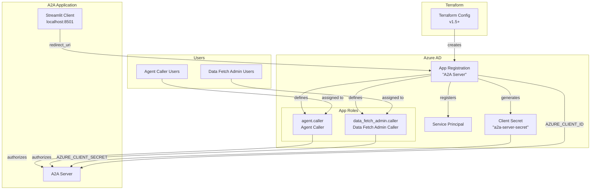

# A2A Server — Azure AD Infrastructure
Minimal description of the terraform infrastructure set up for this.
## Key points
* Use an application **role** instead of assigning an AD group to avoid having to pull through all user groups
* Two roles
  * `agent.caller` allows access to restricted tool (DuckDuckGo)
  * `data_fetch_admin.caller` allows access to rows in `data_fetch` (row level access control example)
* Add an arbitrary list of users to the roles via their user principal names

## Usage
```zsh
terraform plan
terraform apply
terraform output -raw azure_client_secret
```
And populate environment variables in [.env](../.env)

## Architecture



## Resource Summary

| Resource | Type | Purpose |
|---|---|---|
| `azuread_application.a2a_server` | App Registration | OAuth2 identity for the A2A server (sign-in audience: single tenant) |
| `azuread_service_principal.a2a_server` | Service Principal | Enterprise app backing the registration |
| `azuread_application_password.a2a_server` | Client Secret | Server-side credential for token validation |
| `azuread_app_role_assignment.agent_callers` | Role Assignment | Grants `agent.caller` role to specified users |
| `azuread_app_role_assignment.data_fetch_admin_callers` | Role Assignment | Grants `data_fetch_admin.caller` role to specified users |