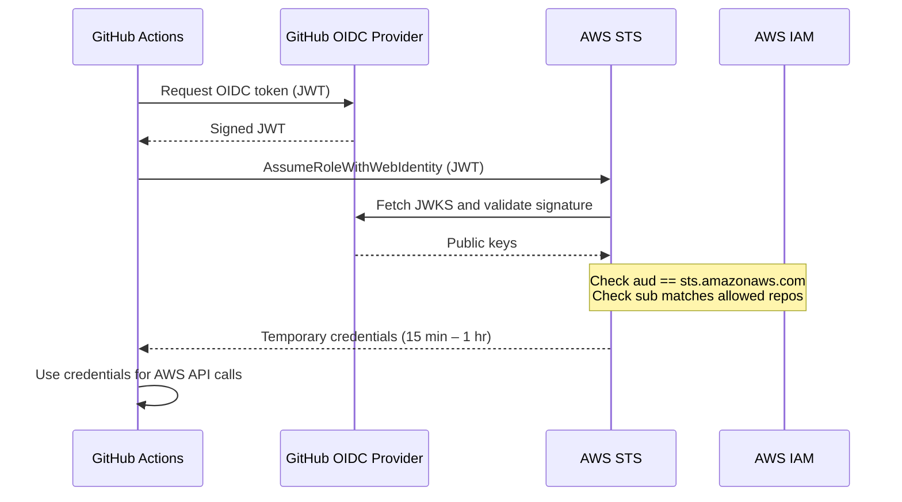
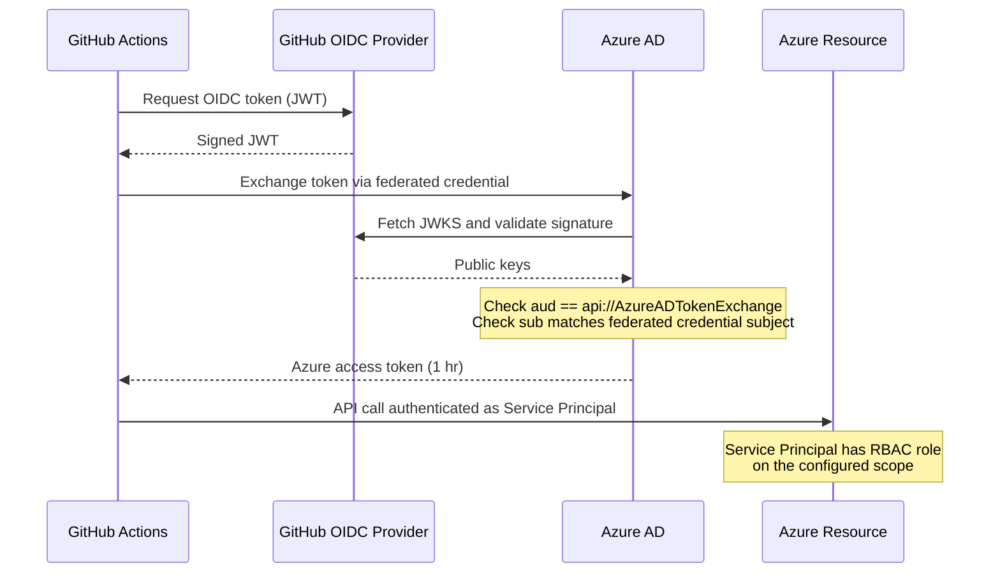

# What is OIDC Authentication and why do I want it.

Github supports [OpenID Connect](https://docs.github.com/en/actions/concepts/security/openid-connect) which allows
GitHub to act as an identity provider.

By setting up a trust relationship in Azure/AWS to Github, you can get github to assume temporary credentials within
your cloud provider to do your deployments for you. This trust relationship gives you fine-grained control of which
`repositories` and `branches` can assume the role/access token.

```
GitHub Actions workflow
  └─ requests OIDC token from GitHub
       └─ presents token to AWS STS / Azure AD
            └─ cloud validates token against GitHub's JWKS endpoint
                 └─ returns short-lived credential (IAM role / access token)
```
# [Repository link](https://github.com/SrzStephen/hugoblog/tree/main/content/posts/oidc_aws_azure/repo)

## Prerequisites

- Terraform cloud configured (`terraform login`)
    - It's expected that the user has `Org` level permissions to be able to create a new project + workspaces in that project.
- AWS CLI configured (`aws login`)
- Azure CLI configured (`az login`)

## Remote state (Terraform Enterprise / Terraform Cloud)

The workspace is **auto-created** on first `terraform init` if it does not already exist.

Edit the `cloud` block in `aws/providers.tf` / `azure/providers.tf` to match your organization and project:

```hcl
cloud {
  hostname     = "app.terraform.io"
  organization = "my-org"
  workspaces {
    project = "oidc_base"            # auto-created on init (need org level token)
    name    = "github-oidc-aws"      # auto-created on init
  }
}
```

---

## AWS module

### How it works



### What it creates

| Resource | Purpose |
|---|---|
| `aws_iam_openid_connect_provider` | Trusts GitHub's OIDC issuer |
| `aws_iam_role` | Role GitHub Actions assumes |
| `aws_iam_role_policy_attachment` | Attaches managed policies to the role |
| `aws_iam_role_policy` | Attaches each `policies/*.json` file as a separate inline policy |

#### Inline policies (`aws/policies/`)

Every `*.json` in `aws/policies/` is loaded in and attached to the role. Policy files are terraform template files that
inject `account_id` for more secure control of resources.

At time of writing there is one policy: `docker-deploy` which is used to deploy resources for a post that I'm writing.

### Usage

```bash
cd aws
terraform init
terraform apply
```

### Variables

| Name | Type | Default | Description |
|---|---|---|---|
| `github_org` | `string` | required | GitHub organisation name (prepended to each repo in the OIDC sub condition) |
| `github_repos` | `list(string)` | `["hugoblog"]` | Repository names **within** `github_org` allowed to assume the role |
| `role_name` | `string` | `"github-deploy-role"` | Name of the IAM role |
| `managed_policy_arns` | `list(string)` | `[]` | Managed policy ARNs to attach |
| `aws_region` | `list(string)` | `["us-east-1"]` | AWS region(s); the first element is used for the provider |
| `tags` | `map(string)` | `{}` | Tags applied to all resources |

### Outputs

| Name | Description |
|---|---|
| `role_arn` | Set as `AWS_ROLE_ARN` in your workflow |
| `role_name` | IAM role name |
| `oidc_provider_arn` | ARN of the GitHub OIDC provider |
| `oidc_sub_conditions` | List of OIDC `sub` conditions used in the assume-role policy |
| `assume_role_policy_json` | Full JSON of the assume-role policy document |

### Tests

I haven't included tests, the thing that I'd want to check is that `SrzStephen` is always in the repo but it's a bit
hard to do when you're loading in template files the way I wanted to.

## Azure module

### How it works



### What it creates

| Resource | Purpose |
|---|---|
| `azuread_application` | App Registration that represents the identity |
| `azuread_service_principal` | Service principal backed by the app |
| `azuread_application_federated_identity_credential` | One credential per repo, scoped to the `main` branch |
| `azurerm_role_assignment` | Grants the service principal Azure RBAC roles at subscription scope |

### Usage
> [!WARNING]
> If you're using terraform enterprise a remote executor, you may run into some problems here, 
> set your workspace executor to local by default.
```bash
cd azure
terraform init
terraform apply
```

### Variables
> [!WARNING]
> Make sure to set a `role_assignments` otherwise you wont have access to any subscriptions.


| Name | Type | Default | Description |
|---|---|---|---|
| `subscription_id` | `string` | required | Azure subscription ID |
| `app_name` | `string` | `"github-deploy"` | App Registration display name |
| `github_org` | `string` | `"SrzStephen"` | GitHub organisation name used as the OIDC subject prefix |
| `github_repos` | `list(string)` | `["hugoblog"]` | Repository names **within** `github_org` to grant federated access |
| `additional_owners` | `list(string)` | `[]` | Extra Azure AD object IDs to add as owners |
| `role_assignments` | `list(string)` | `[]` | Azure RBAC role definition names to assign at subscription scope, e.g. `["Contributor"]` |

### Outputs

| Name | Description |
|---|---|
| `client_id` | Set as `AZURE_CLIENT_ID` in your workflow |
| `tenant_id` | Set as `AZURE_TENANT_ID` in your workflow |
| `subscription_id` | Set as `AZURE_SUBSCRIPTION_ID` in your workflow |
| `service_principal_object_id` | Object ID of the service principal |
| `oidc_subjects` | Map of repo name → federated credential subject (useful for debugging) |

### Tests

```bash
cd azure
terraform test
```

The test suite (`azure/tests/oidc_trust.tftest.hcl`) verifies that:

- Every federated credential subject is scoped to the correct GitHub organisation.
- All subjects are restricted to the `main` branch (`ref:refs/heads/main`).
- The number of credentials matches the number of configured repositories.

---

## GitHub Actions workflows

See [`.github/workflows/`](.github/workflows/) for the CI workflows:

- [`terraform.yml`](.github/workflows/terraform.yml) — runs on every push and PR: format check (`terraform fmt -check -recursive`), then `terraform validate` for both modules (no backend, no credentials required).
- [`verify-oidc.yml`](.github/workflows/verify-oidc.yml) — triggered on push to `main`, PRs, and `workflow_dispatch`: assumes the AWS role and logs in to Azure to confirm that OIDC authentication works end-to-end.

### Required secrets

| Secret | Used by | Description |
|---|---|---|
| `AWS_ROLE_ARN` | `verify-oidc.yml` | Output of `terraform output role_arn` from the AWS module |
| `AZURE_CLIENT_ID` | `verify-oidc.yml` | Output of `terraform output client_id` from the Azure module |
| `AZURE_TENANT_ID` | `verify-oidc.yml` | Output of `terraform output tenant_id` from the Azure module |
| `AZURE_SUBSCRIPTION_ID` | `verify-oidc.yml` | Output of `terraform output subscription_id` from the Azure module |
