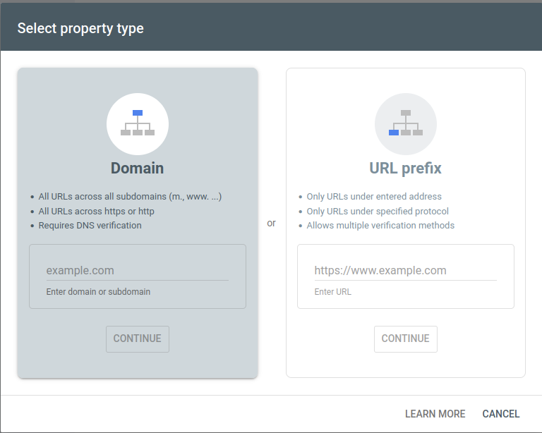
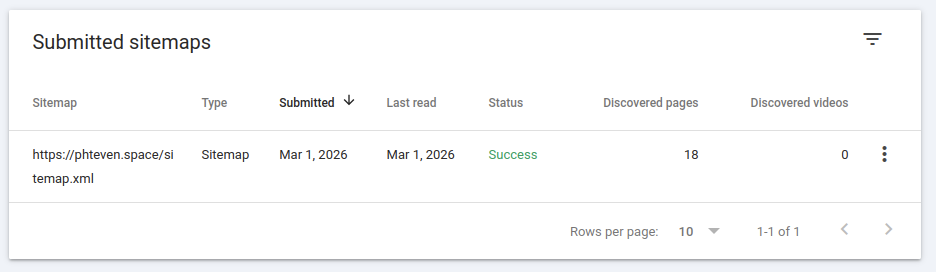
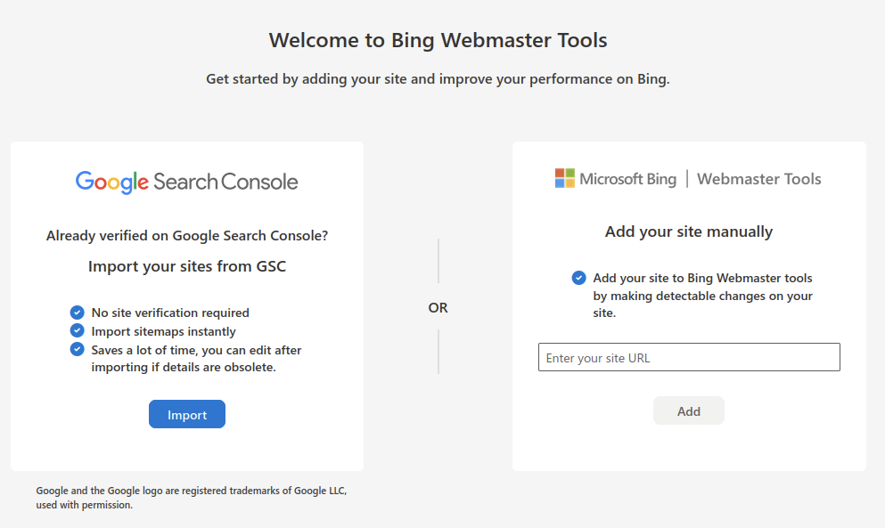
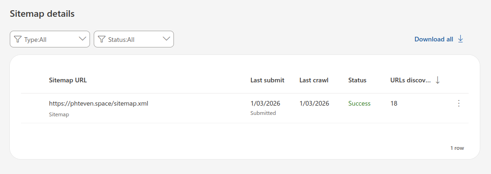

Instead of waiting for search engines to auto discover your website, you can submit a [sitemap](https://developers.google.com/search/docs/crawling-indexing/sitemaps/overview)
to assist search engines in crawling your website.

This blog is created with [hugo](https://gohugo.io/) which can be set up to configure a root `/sitemap.xml` automatically
in the case of this blog, that is located at https://phteven.space/sitemap.xml. This sitemap contains a list of 
urls with a last modified date.
```xml
<urlset>
 <url>
  <loc>
   https://phteven.space/posts/2026/03/terraform-github-aws/azure-oidc-authentication/
  </loc>
  <lastmod>2026-03-01T00:00:00+00:00</lastmod>
 </url>
</urlset>
```
If your goal is to improve your SEO by makign it easier for common English-speaking search engines to find your website
then you will probably want to submit your sitemap to `Google` and `Bing`.
> [!TIP]
> Bing is used behind the scenes for [Yahoo search](https://help.yahoo.com/kb/SLN2217.html)
> I've read that DuckDuckGo uses Bing for sitemaps but have been unable to verify it


## Submit sitemap to Google

Log in to the [google search console](https://search.google.com/search-console/about).

Because I registered my domain through NameCheap, I chose Domain based authentication.



Verification for me was just adding a TXT record.
```zsh
➜ dig +short TXT phteven.space
"google-site-verification={VERIFICATION_CODE_HERE}"
```


Submit your sitemap url, and with under 10 minutes of waiting, Google had parsed my sitemap.




## Submit sitemap to Bing
Log in to the [bing webmaster tools](https://www.bing.com/webmasters/home)

I ended up importing straight from Google so I didn't need to do any extra validations or setup

  

After about 10 minutes it had parsed my sitemap



# Conclusion
Your site should now be indexed faster and you'll have crawl analytics in both consoles.